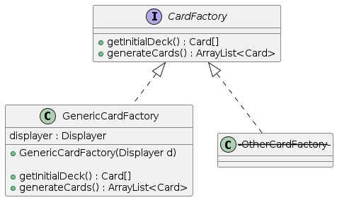
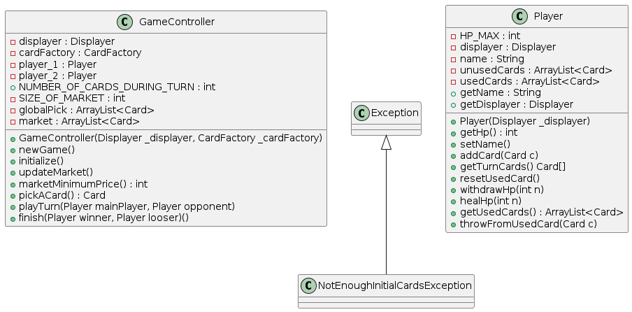
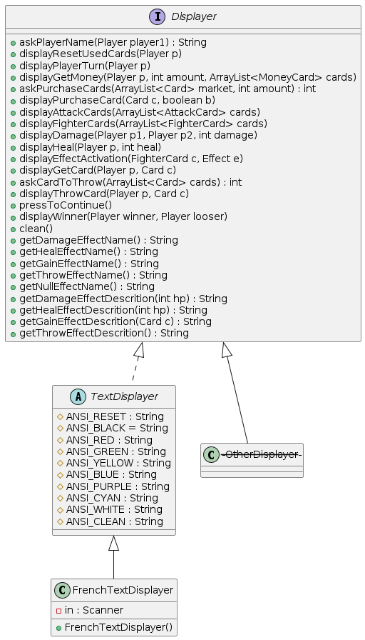

# DeckBuilder

## Projet Personnel 

[](https://forthebadge.com)

## Concept

Le deck-building est un jeu de société, où les joueurs commencent avec les mêmes cartes puis construisent leur paquet au cours de la partie pour améliorer leurs jeux.</br>
Pour plus de détails : https://fr.wikipedia.org/wiki/Jeu_de_deck-building

</br> 

## Lancer le projet

*L'installation de Java est requise pour lancer ce jeu.*

### Script
```bash
# Compiler
javac -sourcepath src -d bin src/Main.java 

# Créer l'exécutable Jar
jar cvfe DeckBuilder.jar Main -C bin ./

# Lancer l'exécutable
java -jar DeckBuilder.jar 
```

### Jouer

Dans cette version, le programme se joue dans un invite de commande avec des entrées clavier. Après avoir demandé aux 2 joueurs d'entrer leurs noms, le jeu commence. <br>
Chaque tour, le joueur tire 5 cartes, d'abord les cartes Money qui permettent d'acheter de meilleures cartes au marché (l'argent est remis à zéro chaque tour). Ensuite les cartes Fighter qui baisse les points de vie de l'adversaire (Atk), en récupère (Def), et active ou non un effet bonus si une carte du même type a été tirée. Enfin, les cartes Attaque qui ingligent des dégats à l'adversaire.<br>
Le premier qui parvient à faire baisser les points de vie de l'autre joueur à zéro gagne la partie.


## Présentation du code

Le programme est organisé en **modèle-vue-contrôleur**, ce qui permet l'implémentation d'une éventuelle interface graphique sans changer le reste du code.

### Card Factory

Pour créer les cartes dans le jeu, le contrôleur fait appel à une classe CardFactory, elle a pour rôle de générer les cartes dans le jeu. Ainsi, pour changer de jeu de carte il suffit d'attribuer au contrôleur une nouvelle CardFactory.<br>
La CardFactory contient deux méthodes, *getInitialDeck()* qui renvoit les cartes que les joueurs ont en début de partie (qui sont les mêmes). Et *generateCards()* qui génère une liste de cartes qui constituera la pioche. 

</br> 


### Controller et Joueur

Le jeu est géré par la classe **GameController** qui organise les tours et la pioche. Elle prends en argument une CardFactory pour distribuer les cartes entre les deux joueurs et la pioche. La class possède aussi un attribut NUMBER_OF_CARDS_DURING_TURN qui permet de configurer le nombre de cartes tirées par les joueurs chaque tour (actuellement 5).

L'exception **NotEnoughCardsException** est levée si le nombre de cartes initiales fournies par la CardFactory est inférieur au nombre de cartes jouées par tour.

Les **Player** ont comme caractéristiques des points de vie, une liste de cartes inutilisées (qui sont les cartes que le joueur peut tirer) et une liste de cartes utilisées (où le joueur doit attendre de tirer toutes ses cartes inutilisées pour les récupérer).<br>


</br> 

## Les Cartes

Le jeu comporte plusieurs types de cartes :
- les cartes Money qui permettent d'acheter d'autres cartes sur le marché
- les cartes Attack qui baissent les points de vie de l'adversaire
- et les cartes Fighter qui baissent les points de vie de l'adversaire, récupère des points de vie pour le joueur, et active un effet si une carte Fighter du même type est tiré.

Les cartes possèdent un nom, une valeur d'achat au marché, et un attribut pour le nombre de Point de Vie infligé ou récupéré. Les cartes Fighter possèdent aussi un **Type** et un **Effet** 

</br> 

### Les types et effets des cartes Fighter

Le **Type** ne contient qu'un nom, ils sont crées dans la CardFactory. 

L'**Effect** est un bonus qui s'active lorsqu'un joueur tire au moins deux cartes Fighter du même type, ce bonus peut être : 
- un **DamageEffect** : une attaque supplémentaire
- un **HealEffect** : des points de vie récupérés en plus
- un **GainCardEffect** : qui fait gagner une carte, soit dans la pioche, ou alors une carte spécifique si elle est donnée en argument
- un **ThrowCardEffect** :  qui permet de jeter une carte définitivement, ce qui est pratique en fin de partie lorsque les premières cartes deviennent trop faible
- et un **NullEffect** : pour les cartes qui ne possèderait pas d'effet particulier.

</br> 

### Displayer

Le **Displayer** est la classe qui affiche le jeu à l'écran et récupère les saisies des utilisateurs. Chaque méthode affiche ou demande une information en particulier. Elle contient également des méthodes comme *getDamageEffectName()* où ici l'effet récupère le nom par défaut, ce qui peut être utile pour une éventuelle traduction du jeu en anglais ou une autre langue.
Le **FrenchTextDisplayer** affiche le jeu dans une console en Français. Elle hérite d'une classe abstraite **TextDisplayer** contennant des constantes permettant l'affichage de couleur dans la console Linux (les caractères ne sont pas reconnus sur l'invite de commande Windows).

</br> 


## Commentaires et améliorations possibles

Beaucoup de méthodes demandent le displayer en argument car les classes ne peuvent pas y accèder directement.

Si on veut une version anglaise et française du jeu, et une interface textuelle et graphique, alors dans la conception actuelle il faut créer 4 classes : *FrenchTextDisplayer*, *FrenchGraphicDisplayer*, *EnglishTextDisplayer*, et *EnglishGraphicDisplayer*.<br>
Il pourrait alors être intéressant rendre la langue indépendante du displayer. Avoir une interface *Langue* et un argument dans le displayer comme ceci : *TextDisplayer(French/English)* et *GraphicDisplayer(Langue)*.

Le système de CardFactory rend facile le changement de jeu de carte. Nous pourrions alors imaginer un système permettant à l'utilisateur de personnaliser son jeu en créeant lui-même ses propres cartes.
